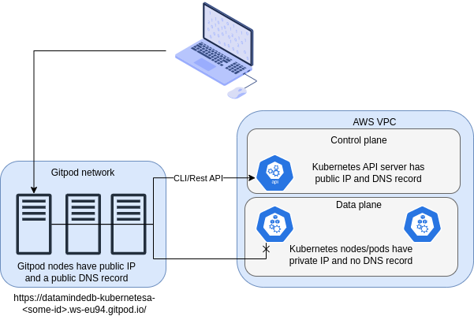

# Services

## Local setup
- create a cluster-ip service for the previous deployment
- load the clusterIP of service
- change cat index of deployment and do rolling upgrade
- refresh clusterIP multiple times


## Gitpod and Eks network setup

If you are running locally, through microk8s or k3s, you can ignore this section and go straight to the exercise.
In order to troubleshoot some networking issues, it is best to have a look at the network setup when using gitpod with eks.




### cluster-ip
- create a cluster-ip service for the previous deployment
  - generate service template using: `kubectl create service clusterip cat-svc --tcp=80:5000 --dry-run=client -o yaml > cat-svc-service.yaml`
- use port forwarding to access the service
  `kubectl port-forward service/cat-svc 8080:80` where local port 8080 and service port is 80.
  Now you can go to the ports tab and click on the browser icon next to port 8080.
- see whether you can see the cat homepage in your browser

### load-balancer service
- change the service to a loadbalancer
  - add the following annotations to the service:
    ```
    service.beta.kubernetes.io/aws-load-balancer-type: "external"
    service.beta.kubernetes.io/aws-load-balancer-scheme: "internet-facing"
    service.beta.kubernetes.io/aws-load-balancer-backend-protocol: "http"
    service.beta.kubernetes.io/aws-load-balancer-ssl-cert: "arn:aws:acm:eu-west-1:338791806049:certificate/e2abe990-b0ed-46cf-9d43-94fff12d4fa6"
    external-dns.alpha.kubernetes.io/hostname: "<first-username>-cat-svc.k8sacademy.waydata.be"
    ```
  - Add https for your service on port 443 as http traffic is often blocked by firewalls or ruled as insecure by browsers. Use the following code block:
    ```
    - name: https
      port: 443
      targetPort: 5000
    ```
- Type the dns record in your browser and see whether you can see the cat homepage: `<first-username>-cat-svc.k8sacademy.waydata.be`
  - Note: it might take a couple of minutes (2-3min) before the dns record can be resolved. Also the loadbalancer on AWS takes some time to startup
- change cat index of deployment and do rolling upgrade
- refresh the webpage multiple times

More information on the annotations can be found on the AWS Load balancer controller: https://kubernetes-sigs.github.io/aws-load-balancer-controller/v2.2/